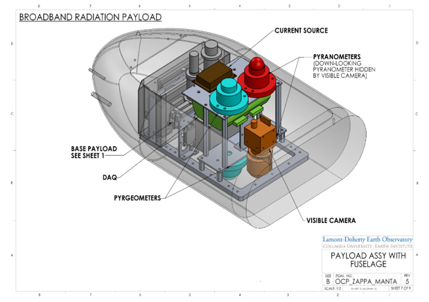

The Real-Time Earth initiative is grounded in the idea that observations drive scientific discovery, and that the Earth sciences are on the threshold of a real-time scientific revolution supported by the proliferation of networked sensors, instruments, devices, and platforms. These sensor systems will enable innovative scientific investigations spanning a large range of spatial and temporal scales and give scientists unprecedented insights into numerous dynamic and interconnected processes on this planet. The Real-Time Earth initiative will help Lamont scientists realize their ideas for making novel measurements and developing connected sensor systems by establishing the Technology Innovation Center. This center will serve as a technology incubator providing Lamont scientists with the tools and resources they need to continue leading the real-time science revolution.

#### Examples of Sensor Engineering at Lamont

**Cabled Observatories**

 
Image credit: National Science Foundation's Ocean Observatories Initiative

Description of Cabled Array work here.

**Drone Science**

 
<!----->

Description of drone research here.

**Icepod**

Description of Icepod here.

******************

### Future

What we want to do.
