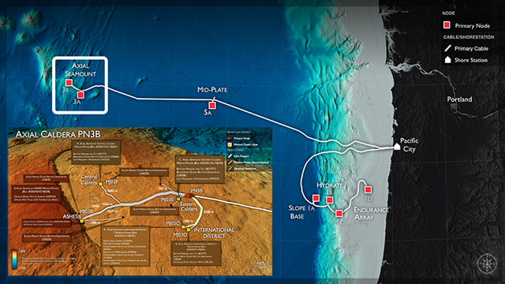
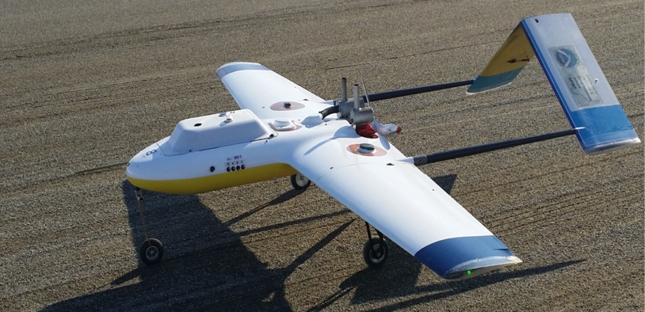
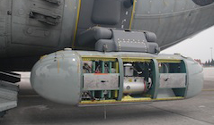
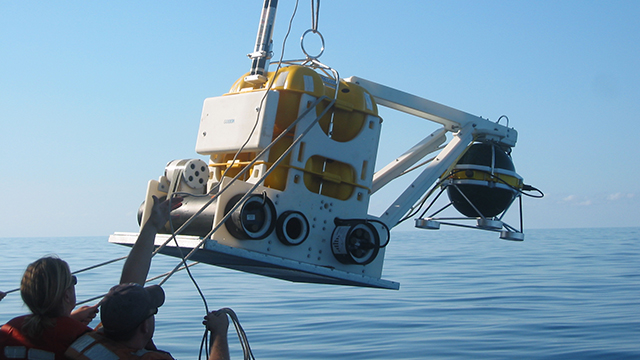

### Now

The Real-Time Earth initiative is grounded in the idea that observations drive scientific discovery, and that the Earth sciences are on the threshold of a real-time scientific revolution supported by the proliferation of networked sensors, instruments, devices, and platforms. These sensor systems will enable innovative scientific investigations spanning a large range of spatial and temporal scales and give scientists unprecedented insights into numerous dynamic and interconnected processes on this planet. Lamont scientists have been leading the nascent real-time science revolution. Here are a just a few examples of their groundbreaking research in this field:

#### Cabled Observatories

  
  Image credit: National Science Foundation's Ocean Observatories Initiative

The Cabled Array, a component of NSF's Ocean Observatories Initiative, became fully operational in 2014. It is the most advanced submarine volcanic observatory in the world, connecting scores of seafloor instruments and water column profilers directly to shore and to the Internet over a ~500 km high power (8 kW) and high bandwidth (10 Gbs) fiber-optic cable. Two-way communication between cabled instruments allows highly interactive scientific investigations of oceanographic and geophysical processes, and can allow rapid responses to geological events such as volcanic eruptions and earthquakes.

With the Cabled Array, scientists now have a real-time, tectonic plate-scale presence in the coastal and deep waters of the NE Pacific Ocean, and can conduct myriad adaptive investigations into multi-scale Earth processes. A number of Lamont scientists have been involved in the development of the Cabled Array, and are now working on the data as it comes in. Lamont scientists are also working to develop new sensor systems that will connect to the Cabled Array to allow next-generation studies using this valuable Earth science platform.

#### Drone Science

  
  Image credit: Chris Zappa

Description of drone research here.

 
#### Icepod

  
  Image credit: ??

Description of Icepod here.

 
#### Ocean Bottom Seismometers

  
  Image credit: ??

Description of OBS systems here.

 

******************

### The Future

The Real-Time Earth initiative will help Lamont scientists realize their ideas for making novel measurements and developing connected sensor systems by establishing the Technology Innovation Center. This center will serve as a technology incubator providing Lamont scientists with the tools they need to continue leading the real-time science revolution. The Tech Center will provide the resources, both in terms of engineering personnel and next-generation fabrication equipment, to help them design new observation-based Earth science experiments. The Tech Center will have a funding and staffing model that will ensure the independence of the group and will allow all scientists across the observatory the ability to plug in to the incubator, create new observing systems, and advance Earth science knowledge.

